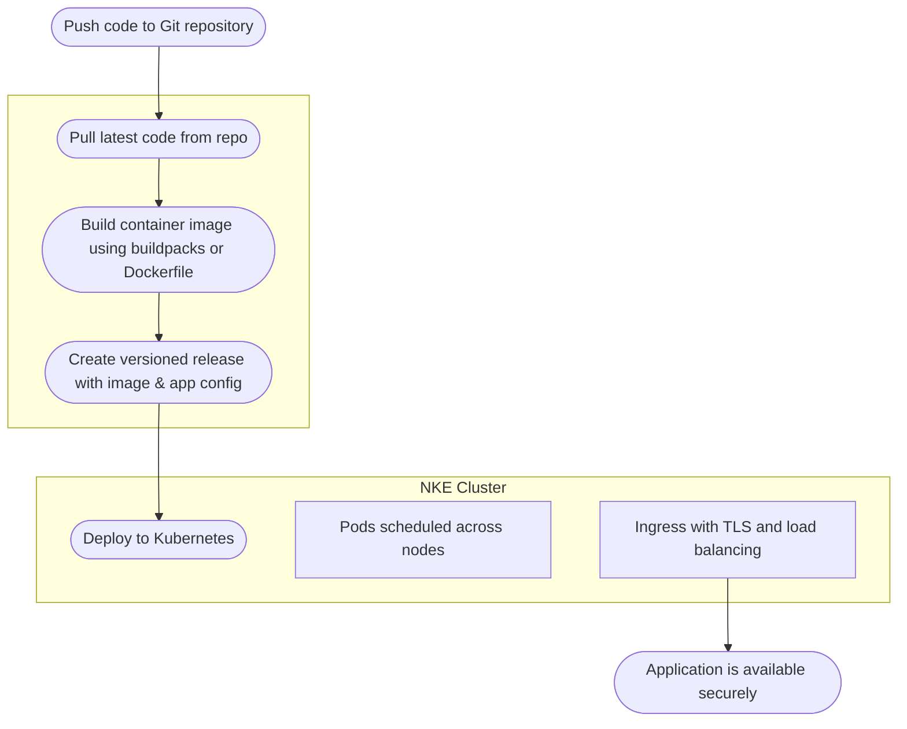

# How Deploio Works

## Repo, Build, Release Process

All you require for deploying an application with Deploio is:

- a git repository with the application codebase 

- a laptop or PC for installing `nctl` and deploying the application 💻

- a domain to point to your application 🌐

##### Repo

Tell Deploio where your source code lives — whether it's GitHub, GitLab, or Bitbucket, or even a private git server. You can specify a branch or tag to deploy from, and Deploio will handle fetching the code securely via OAuth or SSH authentication. Check out [Code Repository Setup](/user-guide/code_repository_setup) for more details.

##### Build

Deploio automatically builds your application using the [Heroku Buildpack](https://elements.heroku.com/buildpacks) or your own Dockerfile. It automatically detects the appropriate language runtime, installs dependencies, and compiles your code into a production-ready image. Build logs are streamed in real-time and stored for traceability.

##### Release

[//]: # (TODO: CHECK - can releases be rolled back via nctl?)

After a successful build, your application is released. The release includes the build artifact, configuration settings, and environment variables. Releases are immutable, versioned, ~~and can be rolled back if needed~~. Deploio also manages secrets and sensitive data securely, differentiating between build and release environment variables, ensuring that they are not exposed to your running app.

##### Run

Deploio runs your application on a managed Kubernetes cluster, powered by **Nine Kubernetes Engine** (NKE), located in Switzerland. Deployments are automatically rolled out using zero-downtime strategies such as rolling updates and health checks. Applications run in isolated pods, scheduled across nodes provisioned via configurable node pools and machine types. This ensures high availability and scalability.

Apps are exposed to the internet via k8 ingress controllers. Other services are not. All communication is secured with TLS (also internally).

While Deploio runs on a scalable Kubernetes infrastructure, your apps don’t autoscale by default. Most apps can live comfortably with vertical scaling — predictable, easy to manage, and fully under your control via code, CI/CD, or manually in the Cockpit. You probably don’t need horizontal scaling, but if you do, We’ve got you. Because we run on real Kubernetes, and we know how to scale things properly. Do you?

For more details on the infrastructure used to run your app, view the Nine Kubernetes Engine documentation [here](https://docs.nine.ch/docs/managed-kubernetes/nke/nine-kubernetes-engine).

## Workflow

##### Code Management

Deploio connects to your Git provider (e.g., GitHub, GitLab, Bitbucket) via SSH. It fetches code from your repo and triggers deployments on push or manual triggers. Unlike Heroku, Deploio does not host your Git repo — it uses your existing setup.

See the [Code Repository Setup](/user-guide/code_repository_setup) page for more detail.

##### Build Automation

Use the official Heroku Cloud Native Buildpacks for languages like Node.js, Ruby, Python, and Go — or define a custom Dockerfile. Builds are cached to speed things up. Configuration isn’t limited to environment variables: Deploio uses a **hierarchical system** that lets you define defaults at the company or project level easily, and override them per app — either in the code or directly in the Cockpit.

##### Deployment

Deployments are rolled out through Kubernetes using rolling updates and readiness checks to ensure zero downtimme. Each deployment references a specific container image and configuration version.

Deploy jobs can also be configured to execute before a new release is deployed. The rollout of the release will only continue if the deploy job finished successfully. This can be defined in the `.deploio.yaml`. See more information [here](/user-guide/configuring_your_application#deploioyaml).

## Glossary of Key Terms

##### Project

A project represents a workspace that contains one or more applications and related services such as databases, Redis instances and object storage. It is a logical grouping of applications and services that share the same codebase, configuration, and deployment settings and billing. Projects are isolated from each other, allowing for better organisation and management of resources.

It is typical that a Project will have an Application running for each environment. But be aware; staging apps can access production services unless access controls are explicitly defined - similar to Heroku.

##### Deployment

The act of **bringing your code to the web**: build and ship a specific state of your code, config, and environment — made live under a domain. Fully reproducible. Fully auditable.

##### Cockpit

The Deploio web interface, providing a visual dashboard to manage your projects, view logs, monitor deployments, and configure settings. It’s your control center. This works hand in hand with nctl, the command-line tool for advanced management.

##### nctl

The official Deploio CLI tool for developers. It can be used for the whole process; from creating a project to deploying an application. It provides a command-line interface for managing your projects, deployments, and environments. You can use it to trigger builds, manage environments, inspect logs, and control deployments right from your terminal.

Learn more about the process on [docs.nine.ch](https://docs.nine.ch).
