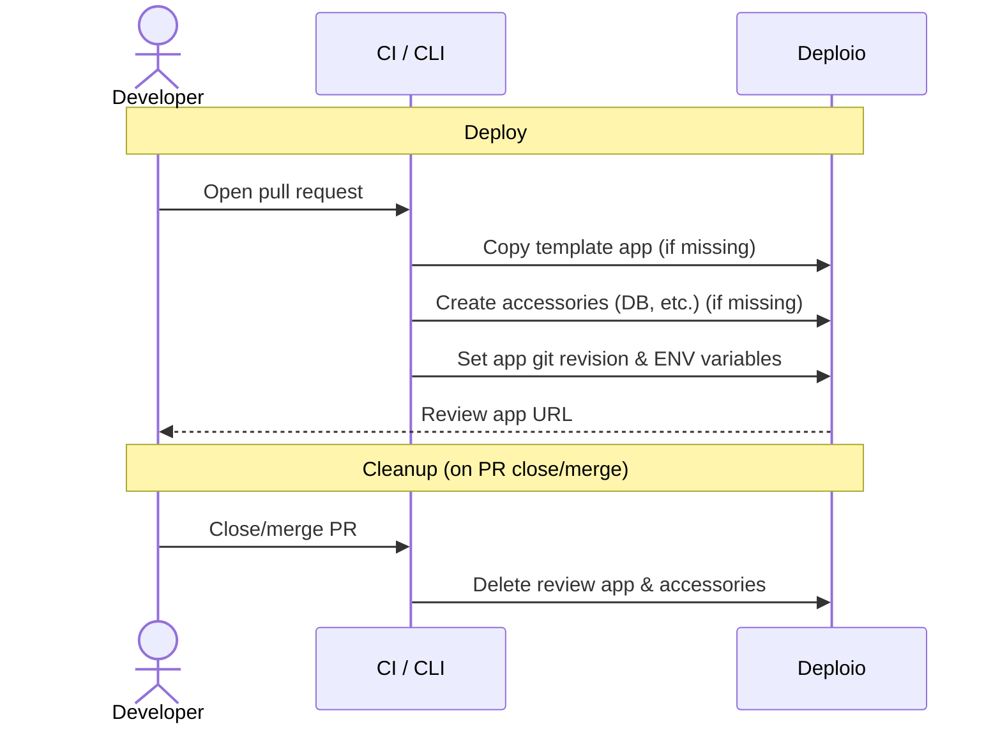
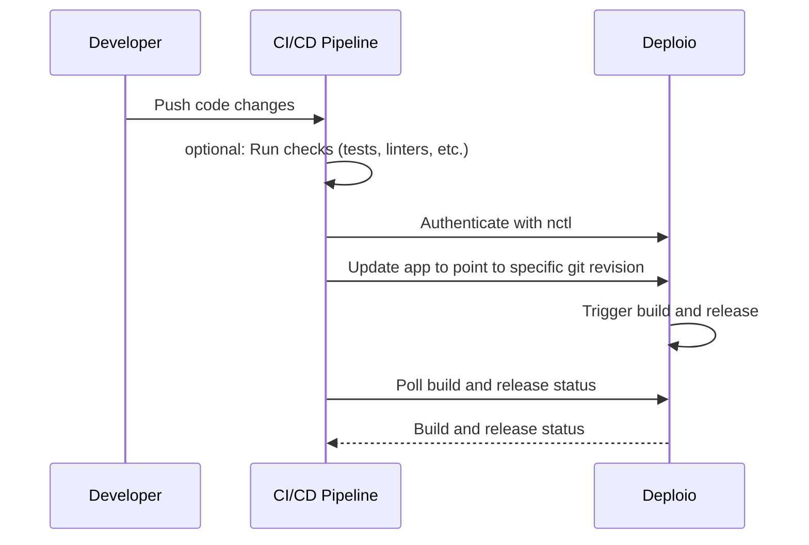

---
prev:
  text: Network & Deployment
  link: /user-guide/network-and-deployment

next:
  text: Monitoring and Logs
  link: /user-guide/monitoring-and-logs
description: Instructions for automating deployments using nctl CLI in CI/CD pipelines with API service accounts, deployment triggers, and status feedback scripts.
---

# CI/CD Integration

This guide explains how you can setup a CI/CD pipeline to automate deployments. We'll provide examples for GitHub actions
and Semaphore. Furthermore, we explain how you could setup review apps.

## Prerequisites

Before setting up CI/CD, you'll need:

- An existing Deploio application linked to a Git repository
- An API Service Account (ASA) for authentication (see [Issue tokens for secure deployment automation](#issue-tokens-for-secure-deployment-automation))

## Continuous Integration

### Linters and tests

The following workflow shows an example CI pipeline with GitHub Actions. It runs linting and tests in parallel.
If all jobs pass, the deployment job is triggered. See [Continuous Deployment](#continuous-deployment) for details 
on how to setup the deployment step.

```yaml
name: CI

on:
  push:
    branches: [main, develop]
  pull_request:

jobs:
  lint:
    runs-on: ubuntu-latest
    timeout-minutes: 5
    steps:
      - uses: actions/checkout@v4
      - name: Install dependencies
        run: npm ci
      - name: Run linters
        run: npm run lint

  test:
    runs-on: ubuntu-latest
    timeout-minutes: 10
    steps:
      - uses: actions/checkout@v4
      - name: Install dependencies
        run: npm ci
      - name: Run tests
        run: npm test
```

### Review Apps

Review apps are currently not supported yet in the Deploio cockpit. However, we provide you the commands that you can use
to automate the setup within your CI/CD pipeline. This makes it fully customizable to your use case.

The integration requires two local scripts.
- `bin/deploy_review_app` to copy the template app and to point the new app to your feature branch
- `bin/delete_review_app` to clean up the created review app and it's accessories (DB, Redis, etc.)

These scripts interact with Deploio in the following way. 



We recommend that you consider the scripts as "templates". You can copy them to your project and customize them as you want.
You might want to replace the Postgres commands with MySQL, or create additional Redis services for example.

`bin/deploy_review_app`
```bash
#!/usr/bin/env bash

set -e

BRANCH_NAME="${1:-$(git branch --show-current)}"

case "$BRANCH_NAME" in
  main|master|develop) echo "Skipping deploy for branch $BRANCH_NAME"; exit 0 ;;
esac

UNIQUE_SUFFIX=$(echo -n "$BRANCH_NAME" | sha1sum | cut -c1-8)
REVIEW_APP_NAME="review-app-${UNIQUE_SUFFIX}"

echo "Deploying $REVIEW_APP_NAME for branch $BRANCH_NAME..."

# Copy App if missing
echo "Checking App..."
nctl get app "$REVIEW_APP_NAME" -p "$DEPLOIO_PROJECT" >/dev/null 2>&1 || \
nctl copy app "$DEPLOIO_TEMPLATE_APP" -p "$DEPLOIO_PROJECT" --start --target-name="$REVIEW_APP_NAME"

# Init Economy DB if missing
echo "Checking Postgres DB..."
nctl get postgresdatabase "$REVIEW_APP_NAME" -p "$DEPLOIO_PROJECT" >/dev/null 2>&1 || \
nctl create postgresdatabase "$REVIEW_APP_NAME" -p "$DEPLOIO_PROJECT" --location=nine-es34 --backup-schedule=disabled --wait
DATABASE_URL=$(nctl get postgresdatabase "$REVIEW_APP_NAME" -p "$DEPLOIO_PROJECT" --print-connection-string)

# Set git revision and ENVs
echo "Updating App..."
nctl update app "$REVIEW_APP_NAME" -p "$DEPLOIO_PROJECT" \
  --git-revision="${BRANCH_NAME}" \
  --env="DATABASE_URL=${DATABASE_URL}" \
  --skip-repo-access-check \
  $ENV_FLAGS

# Output app URL
APP_URL=$(nctl get app "$REVIEW_APP_NAME" -p "$DEPLOIO_PROJECT" -o json | jq -r '.status.atProvider.defaultURLs[0] // empty')
echo "app-name=$REVIEW_APP_NAME"
if [ -n "$APP_URL" ]; then
  echo "app-url=$APP_URL"
fi

# Wait for release to succeed
echo "Waiting for release..."
for i in $(seq 1 60); do
  STATUS=$(nctl get releases -a "$REVIEW_APP_NAME" -p "$DEPLOIO_PROJECT" -o json | jq -r '.[0].status.atProvider.releaseStatus // empty')
  case "$STATUS" in
    available|superseded) echo "release-status=success"; exit 0 ;;
    failed)               echo "release-status=error"; exit 1 ;;
  esac
  sleep 5
done
echo "release-status=error"
exit 1
```

`bin/delete_review_app`
```bash
#!/usr/bin/env bash

set -e

BRANCH_NAME="${1:-$(git branch --show-current)}"

case "$BRANCH_NAME" in
  main|master|develop) echo "Skipping delete for branch $BRANCH_NAME"; exit 0 ;;
esac

UNIQUE_SUFFIX=$(echo -n "$BRANCH_NAME" | sha1sum | cut -c1-8)
REVIEW_APP_NAME="review-app-${UNIQUE_SUFFIX}"

echo "Deleting $REVIEW_APP_NAME for branch $BRANCH_NAME..."

nctl delete app "$REVIEW_APP_NAME" -p "$DEPLOIO_PROJECT" --force --wait || true
nctl delete postgresdatabase "$REVIEW_APP_NAME" -p "$DEPLOIO_PROJECT" --force --wait || true

echo "Deleted $REVIEW_APP_NAME"
```

::: info
You might be wondering why we force delete the resources here. This is in place to skip the deletion confirmation. The `--force`
flag still respects the deletion protection mechanism on your main app. You could limit the risk by enabling deletion protection
on your production environments.
:::

#### GitHub Actions

To automate the review app creation, you could setup e.g. a GitHub Actions workflow. The following workflow
runs automatically as soon as you open a PR, mark it ready for review or close it. In addition, it can also be triggered 
manually in the Actions tab. Once the latest release of the review app is successful, it will mark the deployment in your
pull request.

```yaml
name: Review App

on:
  pull_request:
    types: [opened, ready_for_review, closed]
  workflow_dispatch:

jobs:
  deploy:
    if: github.event.action != 'closed' && !github.event.pull_request.draft
    runs-on: ubuntu-latest
    steps:
      - uses: actions/checkout@v4

      - name: Install nctl
        run: |
          echo 'deb [trusted=yes] https://repo.nine.ch/deb/ /' | sudo tee /etc/apt/sources.list.d/repo.nine.ch.list
          sudo apt-get update -qqo Dir::Etc::sourcelist=/etc/apt/sources.list.d/repo.nine.ch.list
          sudo apt-get install -qq nctl

      - name: Authenticate nctl
        run: |
          nctl auth login \
            --api-client-id=${{ secrets.NCTL_API_CLIENT_ID }} \
            --api-client-secret=${{ secrets.NCTL_API_CLIENT_SECRET }} \
            --organization=${{ secrets.NCTL_ORGANIZATION }}

      - name: Create deployment
        id: deployment
        env:
          GH_TOKEN: ${{ secrets.GITHUB_TOKEN }}
        run: |
          DEPLOYMENT_ID=$(gh api repos/${{ github.repository }}/deployments \
            --input - --jq '.id' \
            <<< '{"ref":"${{ github.head_ref || github.ref_name }}","environment":"review-app","auto_merge":false,"required_contexts":[]}')
          echo "id=$DEPLOYMENT_ID" >> "$GITHUB_OUTPUT"

          gh api repos/${{ github.repository }}/deployments/$DEPLOYMENT_ID/statuses \
            -f state=pending \
            -f description="Deploying review app..."

      - name: Deploy review app
        id: deploy
        env:
          DEPLOIO_PROJECT: my-project
          DEPLOIO_TEMPLATE_APP: main
        run: |
          OUTPUT=$(bin/deploy_review_app "${{ github.head_ref || github.ref_name }}")
          echo "$OUTPUT"
          echo "$OUTPUT" | grep "^app-url=" >> "$GITHUB_OUTPUT" || true
          echo "$OUTPUT" | grep "^app-name=" >> "$GITHUB_OUTPUT" || true

      - name: Deployment success
        if: success()
        env:
          GH_TOKEN: ${{ secrets.GITHUB_TOKEN }}
        run: |
          gh api repos/${{ github.repository }}/deployments/${{ steps.deployment.outputs.id }}/statuses \
            -f state=success \
            -f environment_url="${{ steps.deploy.outputs.app-url }}" \
            -f description="Review app deployed"

      - name: Deployment error
        if: failure() && steps.deployment.outputs.id
        env:
          GH_TOKEN: ${{ secrets.GITHUB_TOKEN }}
        run: |
          gh api repos/${{ github.repository }}/deployments/${{ steps.deployment.outputs.id }}/statuses \
            -f state=error \
            -f description="Review app deployment failed"

  cleanup:
    if: github.event.action == 'closed'
    runs-on: ubuntu-latest
    steps:
      - uses: actions/checkout@v4

      - name: Install nctl
        run: |
          echo 'deb [trusted=yes] https://repo.nine.ch/deb/ /' | sudo tee /etc/apt/sources.list.d/repo.nine.ch.list
          sudo apt-get update -qqo Dir::Etc::sourcelist=/etc/apt/sources.list.d/repo.nine.ch.list
          sudo apt-get install -qq nctl

      - name: Authenticate nctl
        run: |
          nctl auth login \
            --api-client-id=${{ secrets.NCTL_API_CLIENT_ID }} \
            --api-client-secret=${{ secrets.NCTL_API_CLIENT_SECRET }} \
            --organization=${{ secrets.NCTL_ORGANIZATION }}

      - name: Delete review app
        env:
          DEPLOIO_PROJECT: my-project
        run: bin/delete_review_app "${{ github.head_ref || github.ref_name }}"

      - name: Deactivate deployment
        env:
          GH_TOKEN: ${{ secrets.GITHUB_TOKEN }}
        run: |
          DEPLOYMENT_ID=$(gh api "repos/${{ github.repository }}/deployments?ref=${{ github.head_ref || github.ref_name }}&environment=review-app" \
            --jq '.[0].id' 2>/dev/null || true)

          if [ -n "$DEPLOYMENT_ID" ] && [ "$DEPLOYMENT_ID" != "null" ]; then
            gh api repos/${{ github.repository }}/deployments/$DEPLOYMENT_ID/statuses \
              -f state=inactive \
              -f description="Review app deleted"
          fi
```

::: info
Replace `my-project` with your Deploio project name and `main` with the name of your template application. The template app is copied to create each review app, so it should be configured with your desired defaults.
:::

## Continuous Deployment

### Automate deployments

When you link a GitHub repository and target branch to your Deploio application, the application automatically 
re-deploys whenever you push a change to that branch. If this is sufficient for your workflow, no additional CI/CD setup
is needed.

For more control — such as deploying only after tests pass, deploying specific commits, or getting deployment status 
feedback — you can automate deployments using `nctl` in your CI/CD pipeline. The following sections explain how to do this.

### Revision-based deployments

The concept behind revision-based deployments is pretty simple. Instead of pointing your Deploio app to a branch, we
point it to a specific git revision (commit SHA). This way, the Deploio build is triggered exactly
for the specified state of the repository.

#### Flow

The following sequence diagram summarizes the revision-based deployment flow:



#### Install `nctl`

Configure your CI process to install and authenticate the `nctl` CLI. You'll need the following secrets set in your CI environment:

| Secret | Description |
|---|---|
| `NCTL_API_CLIENT_ID` | The client ID from your API Service Account |
| `NCTL_API_CLIENT_SECRET` | The client secret from your API Service Account |
| `NCTL_ORGANIZATION` | Your Nine organization name |

Install and authenticate `nctl`:

```bash
# Install nctl (Debian/Ubuntu)
echo 'deb [trusted=yes] https://repo.nine.ch/deb/ /' | sudo tee /etc/apt/sources.list.d/repo.nine.ch.list
sudo apt-get update -qqo Dir::Etc::sourcelist=/etc/apt/sources.list.d/repo.nine.ch.list
sudo apt-get install -qq nctl
```

#### Create an API Service Account

Create an API Service Account (ASA) so your CI pipeline can authenticate without using personal credentials.

Create a new ASA:

```bash
nctl create asa {token_name}
```

View the token:

```bash
nctl get apiserviceaccount {token_name} --print-token
```

Authenticate `nctl` using the ASA credentials:

```bash
nctl auth login \
  --api-client-id=$NCTL_API_CLIENT_ID \
  --api-client-secret=$NCTL_API_CLIENT_SECRET \
  --organization=$NCTL_ORGANIZATION
```

⚠️ Store the client ID and secret as secrets in your CI environment. Never commit them to your repository.

#### Update app git revision

Set the following environment variables in your CI pipeline:

| Variable | Description |
|---|---|
| `DEPLOIO_PROJECT` | Your Deploio project name |
| `DEPLOIO_APP_NAME` | Your Deploio application name |

Then use `nctl` to update the application to a specific git revision:

```bash
nctl update app $DEPLOIO_APP_NAME \
  --project $DEPLOIO_PROJECT \
  --git-revision=$(git rev-parse HEAD) \
  --skip-repo-access-check
```

::: info
The `--skip-repo-access-check` flag skips the repository access check during the update. This is useful in CI environments where `nctl` doesn't have direct access to the Git repository.
:::

#### Poll build and release status

After triggering a deployment, you can poll Deploio for the build and release status. This lets your CI pipeline report whether the deployment succeeded or failed.

Below is an example script in Ruby that checks the build and release status. You can adapt this to any language.

```ruby
require 'yaml'
require 'open3'

TIMEOUT_IN_SECONDS = 300
INTERVAL_IN_SECONDS = 30

PROJECT = ENV['DEPLOIO_PROJECT']
APP_NAME = ENV['DEPLOIO_APP_NAME']
REVISION = `git rev-parse HEAD`.strip

def fetch_builds(project, app_name)
  command = "nctl get builds --project=#{project} --application-name=#{app_name} --output=yaml"
  stdout, stderr, status = Open3.capture3(command)

  unless status.success?
    puts "Error fetching build information: #{stderr}"
    exit 1
  end

  YAML.load_stream(stdout)
end

def fetch_releases(project, app_name)
  command = "nctl get releases --project=#{project} --application-name=#{app_name} --output=yaml"
  stdout, stderr, status = Open3.capture3(command)

  unless status.success?
    puts "Error fetching release information: #{stderr}"
    exit 1
  end

  YAML.load_stream(stdout)
end

def find_build_for_revision(builds, revision)
  builds.find do |build|
    build.dig('spec', 'forProvider', 'sourceConfig', 'git', 'revision') == revision
  end
end

def find_release_for_build(releases, build_name)
  releases.find do |release|
    release.dig('spec', 'forProvider', 'build', 'name') == build_name
  end
end

def build_status(build)
  build.dig('status', 'atProvider', 'buildStatus')
end

def release_status(release)
  release.dig('status', 'atProvider', 'releaseStatus')
end

puts "(1/2) Checking build status for revision #{REVISION}..."

elapsed = 0
build = nil
while elapsed < TIMEOUT_IN_SECONDS
  builds = fetch_builds(PROJECT, APP_NAME)
  build = find_build_for_revision(builds, REVISION)

  if build
    case build_status(build)
    when 'success'
      puts "Build succeeded for revision #{REVISION}"
      break
    when 'failed'
      puts "Build failed for revision #{REVISION}"
      exit 1
    else
      puts "Build status is #{build_status(build)}, waiting..."
    end
  else
    puts "No matching build found for revision #{REVISION}, waiting..."
  end

  sleep INTERVAL_IN_SECONDS
  elapsed += INTERVAL_IN_SECONDS
end

if elapsed >= TIMEOUT_IN_SECONDS || build.nil?
  puts "Build check timed out after #{TIMEOUT_IN_SECONDS} seconds."
  exit 1
end

build_name = build.dig('metadata', 'name')
puts "(2/2) Checking release status for build #{build_name}..."

elapsed = 0
while elapsed < TIMEOUT_IN_SECONDS
  releases = fetch_releases(PROJECT, APP_NAME)
  release = find_release_for_build(releases, build_name)

  if release
    case release_status(release)
    when 'available'
      puts "Release is available for build #{build_name}. Deployment successful."
      exit 0
    when 'failed'
      puts "Release failed for build #{build_name}."
      exit 1
    else
      puts "Release status is #{release_status(release)}, waiting..."
    end
  else
    puts "No matching release found for build #{build_name}, waiting..."
  end

  sleep INTERVAL_IN_SECONDS
  elapsed += INTERVAL_IN_SECONDS
end

puts "Release check timed out after #{TIMEOUT_IN_SECONDS} seconds."
exit 1
```

Run the script after triggering the deployment:

```bash
ruby bin/check_deploio_deployment_status.rb
```

### GitHub Actions

Here's an example GitHub Actions workflow that deploys your application after tests pass:

```yaml
name: Deploy

on:
  push:
    branches: [main]

jobs:
  test:
    runs-on: ubuntu-latest
    steps:
      - uses: actions/checkout@v4
      - name: Run tests
        run: |
          # Add your test commands here
          echo "Running tests..."

  deploy:
    needs: test
    runs-on: ubuntu-latest
    steps:
      - uses: actions/checkout@v4

      - name: Install nctl
        run: |
          echo 'deb [trusted=yes] https://repo.nine.ch/deb/ /' | sudo tee /etc/apt/sources.list.d/repo.nine.ch.list
          sudo apt-get update -qqo Dir::Etc::sourcelist=/etc/apt/sources.list.d/repo.nine.ch.list
          sudo apt-get install -qq nctl

      - name: Authenticate nctl
        run: |
          nctl auth login \
            --api-client-id=${{ secrets.NCTL_API_CLIENT_ID }} \
            --api-client-secret=${{ secrets.NCTL_API_CLIENT_SECRET }} \
            --organization=${{ secrets.NCTL_ORGANIZATION }}

      - name: Deploy to Deploio
        run: |
          nctl update app ${{ vars.DEPLOIO_APP_NAME }} \
            --project ${{ vars.DEPLOIO_PROJECT }} \
            --git-revision=$(git rev-parse HEAD) \
            --skip-repo-access-check
```

### Semaphore

Create a deployment pipeline file (e.g., `main-deploy.yml`) that installs `nctl`, authenticates, and triggers the deployment:

```yaml
version: v1.0
name: Deploy to Deploio

agent:
  machine:
    type: f1-standard-4
    os_image: ubuntu2204

blocks:
  - name: deploy
    task:
      secrets:
        - name: deploio-credentials
      jobs:
        - name: deploy
          commands:
            - echo 'deb [trusted=yes] https://repo.nine.ch/deb/ /' | sudo tee /etc/apt/sources.list.d/repo.nine.ch.list
            - sudo apt-get update -qqo Dir::Etc::sourcelist=/etc/apt/sources.list.d/repo.nine.ch.list
            - sudo apt-get install -qq nctl
            - nctl auth login --api-client-id=$NCTL_API_CLIENT_ID --api-client-secret=$NCTL_API_CLIENT_SECRET --organization=$NCTL_ORGANIZATION
            - nctl update app $DEPLOIO_APP_NAME --project $DEPLOIO_PROJECT --git-revision=$(git rev-parse HEAD) --skip-repo-access-check
```

#### Auto-promote after tests

In your main pipeline file, add a promotion that triggers the deployment pipeline when tests pass:

```yaml
promotions:
  - name: deploy
    deployment_target: production
    pipeline_file: main-deploy.yml
    auto_promote:
      when: result = 'passed' and branch = 'main'
```
