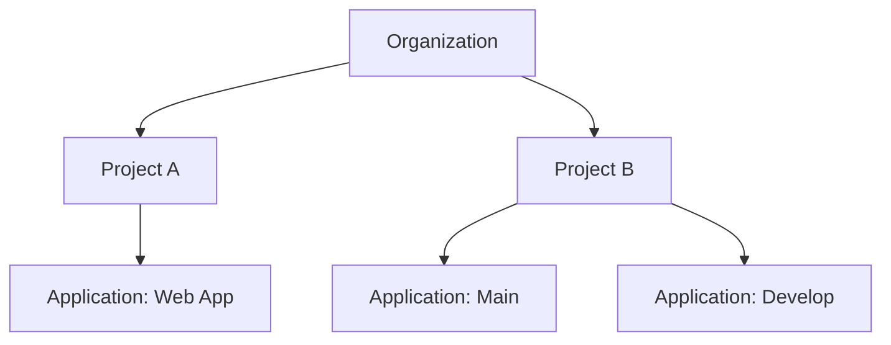

---
prev:
  text: How Deploio Works
  link: /introduction/how-deploio-works
next:
  text: Code Repository Setup
  link: /user-guide/code-repository-setup
description: Complete guide for getting started with Deploio including nctl CLI installation, account setup, project creation, and best practices to avoid common pitfalls.
---

# Getting Started

This guide helps you get up and running with **Deploio**, from installing the CLI (`nctl`) to creating your first project. You'll also find resources, best practices, and common pitfalls to avoid.

## Installing nctl

**`nctl`** is the command-line interface used to interact with Deploio and the underlying Nine Kubernetes Engine (NKE). You can use it to manage projects, trigger deployments, view logs, and more.

📄 **Read the full nctl API docs [here](https://docs.nine.ch/api/)**

#### Step-by-step setup:

1. Download and install `nctl`. Various methods of installation are detailed on the [Github page](https://github.com/ninech/nctl#setup).

2. Login to the API (providing you have an account) using:
```bash
nctl auth login
```

3. Check you are authenticated and have access to the API:
```bash
nctl auth whoami
```

4. View your available projects:
```bash
nctl get all
```

## Creating an account

##### Setting up access within an organization

[//]: # (TODO: I'm not so sure actually on how to do this - ask somebody who has done this? Samuel? Or do I have to contact Nine in this case too?)

Accounts in Deploio are tied to your **Customer Account** (or `organization`). When logging in via nctl, your identity and permissions reflect what’s configured in the Cockpit for your organization.

If you have Administrator access on the organization, you can manage users and access for the organization directly in the [Cockpit](https://cockpit.nine.ch/en/customer/contacts).

If the organization already exists and you need a new user account, you need to:

- Ask your admin to invite you to the correct organization
- Log in using your credentials provided
- Authenticate `nctl` (see [here](/introduction/how-deploio-works.md#nctl))

Once you are set up, you can check your available organizations once logged in on the CLI by running `nctl auth whoami`.

##### Setting up a new user or organization

If you do not have an organization setup and wish to do so, you should contact Nine directly. There is a contact form and details at [Deplo.io](https://deplo.io/).

[//]: # (TODO: Surely we can also make an account not tied to an organization? idk)

Should you wish to create an individual user, you can do so on the [Cockpit registration page](https://cockpit.nine.ch/de/signup?).

[//]: # (TODO: what about via nctl? is this possible?)

## Setting up your first project

In Deploio, the structure follows a strict hierarchy:



<br></br>
A created `Organization` is the top-level entity, which can contain multiple projects.

A `Project` is the logical container to group applications within. Each project can have multiple applications. This structure allows for better organization and management of resources.

An `Application` is the actual deployment unit. It can be a web application, a microservice, or any other deployable unit. Each application is associated with a specific project and inherits the default configuration from the project unless specified otherwise.

You can see an explanation of the configuration levels [here](https://docs.nine.ch/docs/deplo-io/configuration/deploio-configuration-layers/).

## Useful resources

##### Blogs

There are a number of blogs and other resources available that can provide more information and use cases for Deploio. Please see a list below:


##### Quick start guides

🚧 Under construction 🚧

[//]: # (TODO: do we have any quick start guides? We have the migrating to Heroku blog but anything like this could be added to a new section)
[//]: # (We have quick start guides for a number of technologies. Please see them [here]&#40;/quick_start&#41;)

##### Videos

🚧 Under construction 🚧

[//]: # (TODO: As above... any videos?!)
[//]: # (We have also posted tutorial videos showing how Deploio works. Please view these [here]&#40;#&#41;)

## Avoid commom pitfalls

- If you are **using Node in your application**, you need:
  - A `package.json` in the root of the project
  - The following environment variable during the build process:
    `BP_INCLUDE_NODEJS_RUNTIME="true"`

- Always **check your current session** and access with:
  `nctl auth whoami`

- Always make sure you **set the project** in which you wish to make changes with:
  `nctl auth set-project my-project`

- Otherwise, you can specifically **set the project as a flag**. For example:
  `nctl get configs --project=org-my-project `

- Projects are **prefixed with your organization name**. For example `my-project` within `org` can be referred to as `org-my-project`.

## Best Practices for Beginners

[//]: # (- Suggested defaults for deployment configurations with explanation)
[//]: # (- Security guidelines for managing secrets and roles)

- Store secrets securely using environment variables managed via Cockpit or nctl.
- Regularly review and update your configurations to ensure they meet the latest security and performance standards.
- Use staging environments to test your applications before deploying to production.
- Monitor your applications using the avaiable [tools](/user-guide/tools.md).
