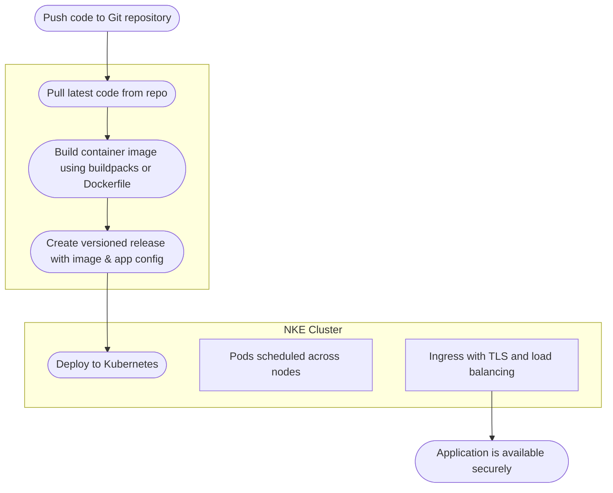

# How Deploio Works

### Repo, Build, Release Process

All you require for deploying an application with Deploio is:

- a git repository with the application codebase 

- a laptop or PC for installing `nctl` and deploying the application 💻

- a domain to point to your application 🌐

##### Repo

Tell Deploio where your source code lives — whether it's GitHub, GitLab, or Bitbucket, or even a private git server. You can specify a branch or tag to deploy from, and Deploio will handle fetching the code securely via OAuth or SSH authentication. Check out [Code Repository Setup](/documentation/03_code_repository_setup.md) for more details.

##### Build

Deploio automatically builds your application using the [Heroku Go Cloud Native Buildpack](https://github.com/heroku/buildpacks-go/) or your own Dockerfile. It automatically detects the appropriate language runtime, installs dependencies, and compiles your code into a production-ready image. Build logs are streamed in real-time and stored for traceability.

##### Release

[//]: # (TODO: CHECK - can builds be rolled back via nctl?)

After a successful build, your application is released. The release includes the build artifact, configuration settings, and environment variables. Releases are immutable, versioned, ~~and can be rolled back if needed~~. Deploio also manages secrets and sensitive data securely, differentiating between build and release environment variables, ensuring that they are not exposed in your codebase.

##### Run

Deploio runs your application on a managed Kubernetes cluster, powered by Nine Kubernetes Engine (NKE). Deployments are automatically rolled out using zero-downtime strategies such as rolling updates and health checks. Applications run in isolated pods, scheduled across nodes provisioned via configurable node pools and machine types. This ensures high availability and scalability.

All services are secured with TLS and routed via ingress controllers. The underlying infrastructure includes container runtimes, node pools, and autoscaling.

For more details on the infrastructure used to run your app, view the Nine Kubernetes Engine documentation [here](https://docs.nine.ch/docs/managed-kubernetes/nke/nine-kubernetes-engine).

### Workflow

##### Code Management

Deploio integrates directly with your version control system, triggering builds automatically on push or via manual actions. It supports multiple providers like GitHub, GitLab, and Bitbucket, and offers fine-grained control over which branches or tags are deployed.

##### Build Automation

Use our default buildpacks for popular languages like Node.js, Ruby, Python, and Go, or define a custom Docker image. Caching is used to speed up builds, and environment variables can be set per project or per application.

##### Deployment

Deployments are fast, safe, and versioned. Kubernetes does the heavy lifting behind the scenes, ensuring containers are scheduled efficiently and traffic is routed correctly. Every deployment is monitored, and failed releases do not result in downtime.

### Glossary of Key Terms

##### Project

A project represents a workspace that contains one or more applications and related services such as databases, Redis instances and object storage. It is a logical grouping of applications and services that share the same codebase, configuration, and deployment settings, and environment variables can also be set at Project level. Projects are isolated from each other, allowing for better organisation and management of resources.

It is typical that a Project will have an Application running for each environment.

##### Deployment

The act of pushing a new version of your application live, using a specific build and configuration. Deployments are tracked and auditable.

##### Cockpit

The Deploio web interface, providing a visual dashboard to manage your projects, view logs, monitor deployments, and configure settings. It’s your control center. This works hand in hand with nctl, the command-line tool for advanced management.

##### nctl

The official Deploio CLI tool for developers. It can be used for the whole process; from creating a project to deploying an application. It provides a command-line interface for managing your projects, deployments, and environments. You can use it to trigger builds, manage environments, inspect logs, and control deployments right from your terminal.

Learn more about the process on [docs.nine.ch](https://docs.nine.ch).
